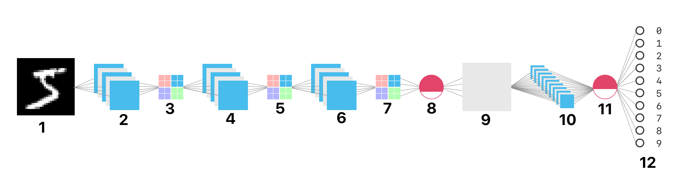

# Handwritten Digits Recognition

Convolutional Neural Network to predict handwritten digits using Tensorflow

## What is a Convolutional Neural Network ? 🤔

“A convolutional neural network is a class of deep, feed-forward artificial neural networks that have successfully been applied to analyzing visual imagery.

They were inspired by biological processes in that the connectivity pattern between neurons resembles the organization of the animal visual cortex. Individual cortical neurons respond to stimuli only in a restricted region of the visual field known as the receptive field. The receptive fields of different neurons partially overlap such that they cover the entire visual field.”

---

## The MNIST Dataset ✍️

The [**MNIST database**](https://en.wikipedia.org/wiki/MNIST_database) is arguably the most famous database in the field of machine learning; it is a large database of **28**x**28** pixel images of handwritten digits created in 1999 by [Yann LeCun](http://yann.lecun.com/).

---

## The Model 💻

Our model consists of 12 layers:

1. Input (**28**x**28** pixel image)
2. Conv2D (Relu activation)
3. MaxPooling2D
4. Conv2D (Relu activation)
5. MaxPooling2D
6. Conv2D (Relu activation)
7. MaxPooling2D
8. Dropout (0.3)
9. Flatten
10. Dense
11. Dropout (0.4)
12. Dense (Softmax activation)

---

## Creating and Training The Model 👩‍🏫

The model was created and trained using [Keras](https://keras.io/) (a high-level neural networks API, written in Python)

